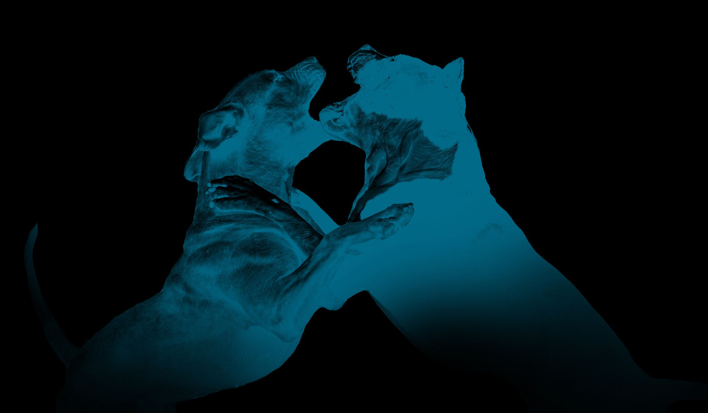
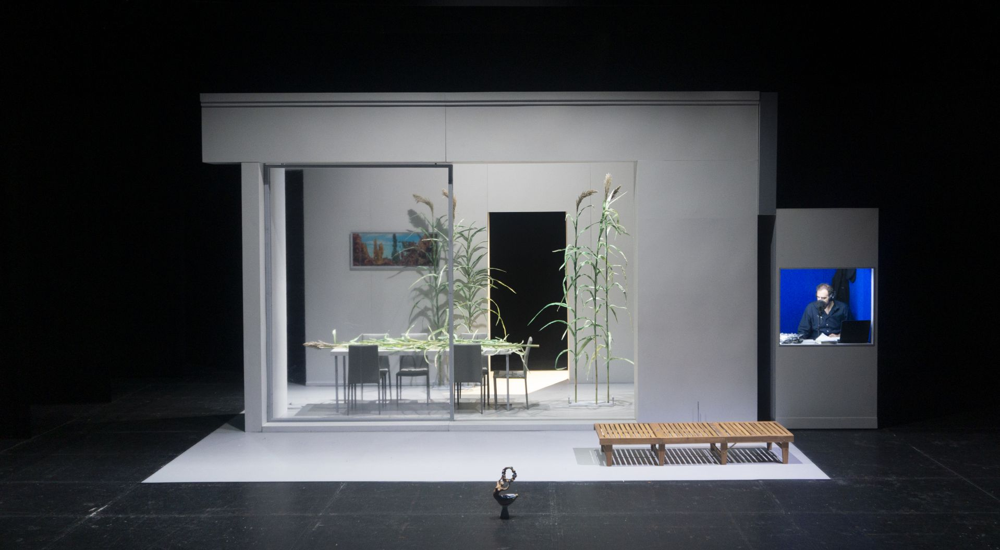
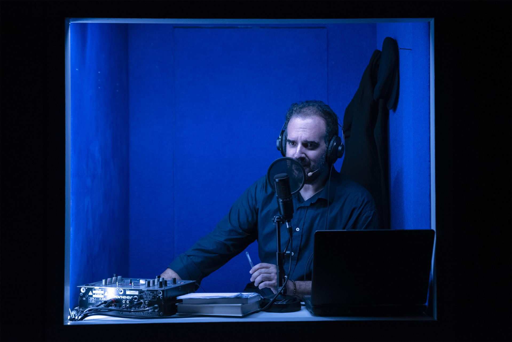

Vincitore di 4 premi UBU, La Ferocia, è uno spettacolo della compagnia VicoQuartoMazzini, tratto dall’omonimo romanzo di Nicola Lagioia.
Dopo aver ascoltato le musiche composte da Pino Basile e aver compreso le scelte registiche e attoriali dello spettacolo, ho individuato la necessità di differenziare due distinti piani sonori: un piano di background e un piano strettamente correlato e compartecipe della narrazione e dell’azione scenica.
La musica è una presenza costante all’interno dello spettacolo. L’utilizzo di un rear composto da due diffusori posizionati ai lati della scena mi ha permesso di sostenere il disegno sonoro, destinando il main P.A. principalmente alle voci nei momenti in cui la musica svolge una funzione di background.
In alcune scene — soprattutto nei monologhi dei personaggi — la musica trova invece spazio anche nel main P.A., contribuendo a sostenere il recitato e ampliandone la dimensione emotiva.
Lo spettacolo si muove infatti dinamicamente tra momenti di prosa più classica, nei quali il microfono svolge prevalentemente una funzione di rinforzo, e momenti in cui voce e musica vengono trattate con un approccio più cinematografico, diventando parte integrante della drammaturgia sonora.
Allo stesso modo, anche il lavoro sulle voci è stato sviluppato su due livelli differenti: da una parte la voce del giornalista Sangirardi, cronista della vicenda; dall’altra le voci dei personaggi che la storia la attraversano e la vivono.
Per questo motivo, la scelta tecnica è ricaduta sull’utilizzo di un microfono da studio per le parti di cronaca — che avvengono all’interno di una cabina di registrazione integrata nella scena — e su una microfonazione puntuale tramite lavalier per i personaggi che abitano gli spazi della villa, sia all’interno che all’esterno.
Quando il giornalista Sangirardi entra direttamente in relazione con i personaggi, nei dialoghi e nei botta e risposta, anche lui utilizza un lavalier. La necessità era infatti quella di distinguere chiaramente, anche dal punto di vista sonoro, la figura del cronista da quella del personaggio immerso nell’azione.
Un utilizzo marcato delle sole basse frequenze è stato utilizzato al fine di sottolineare particolari momenti di forte intensità emotiva, per poi ritornare a uno spettro sonoro più completo ed equilibrato, riconsegnando allo spettatore una zona di comfort percettivo, pronta nuovamente per essere destabilizzata.
Tante sono le scene in cui avvengono flashback e tanti sono i momenti in cui alcune voci da protagoniste diventano background e viceversa, una  delicata fase di programmazione e automazione dell’intero spettacolo ha permesso di poter essere traducibile in maniera fedele da replica a replica, nell’intenzione di fornire uno spettacolo sempre con le medesime caratteristiche e intenzioni.

regia Michele Altamura, Gabriele Paolocà
adattamento Linda Dalisi
con Michele Altamura, Leonardo Capuano, Gaetano Colella, Enrico Casale, Francesca Mazza, Marco Morellini, Gabriele Paolocà, Andrea Volpetti

scenografie  Daniele Spanò
disegno luci Giulia Pastore
musiche Pino Basile
costumi Lilian Indraccolo
aiuto regia Jonathan Lazzini
realizzazione scenografie Officina Scenotecnica Gli Scarti
direttore di scena Daniele Corsetti
progetto audio Niccolò Menegazzo
datore luci Marco Piazze
cura della produzione Francesca D’Ippolito
ufficio stampa Maddalena Peluso
foto Valerio Polici
grafica Leonardo Mazzi
consulenza artistica Gioia Salvatori

produzione SCARTI Centro di Produzione Teatrale d’Innovazione, Elsinor Centro di Produzione Teatrale, LAC Lugano Arte e Cultura, Romaeuropa Festival, Tric Teatri di Bari, Teatro Nazionale Genova

