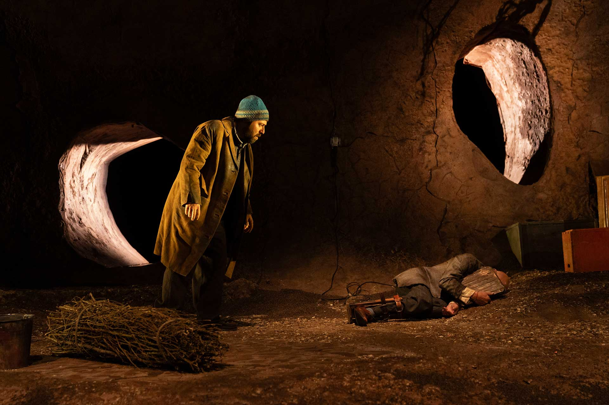
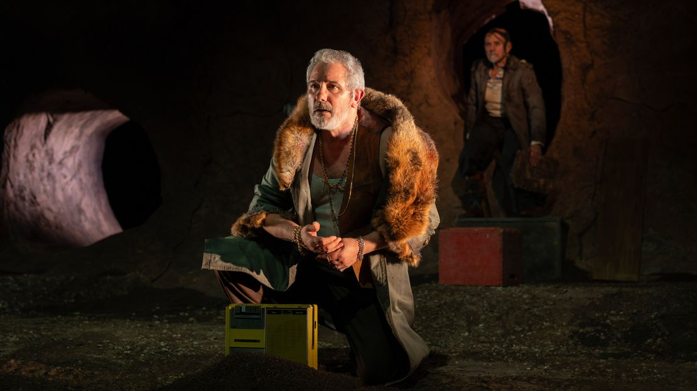

dal romanzo di
Bernardo Zannoni (Sellerio editore)   

ideazione
VicoQuartoMazzini 

drammaturgia
Linda Dalisi
Gabriele Paolocà
Michele Altamura

regia
Michele Altamura
Gabriele Paolocà

con (in ordine alfabetico) 
Michele Altamura
Leonardo Capuano
Giuseppe Cederna
Jonathan Lazzini
Gabriele Paolocà
Arianna Scommegna

scene    
Daniele Spanò

costumi
Aurora Damanti    

luci
Giulia Pastore

musica originale
Demetrio Castellucci

sound designer e fonico 
Niccolò Menegazzo     

realizzazione scenografie  
Officina Scenotecnica Gli Scarti 

aiuto regia
Giulia Odetto

macchinista 
Letizia Paternieri  

datore luci  
Alessandro Di Fraia  

cura della produzione
Francesca D’Ippolito

produzione    
LAC Lugano Arte e Cultura
Scarti Centro di Produzione Teatrale d’Innovazione
Piccolo Teatro di Milano – Teatro d’Europa
TSU – Teatro Stabile dell’Umbria
Teatro Nazionale di Genova