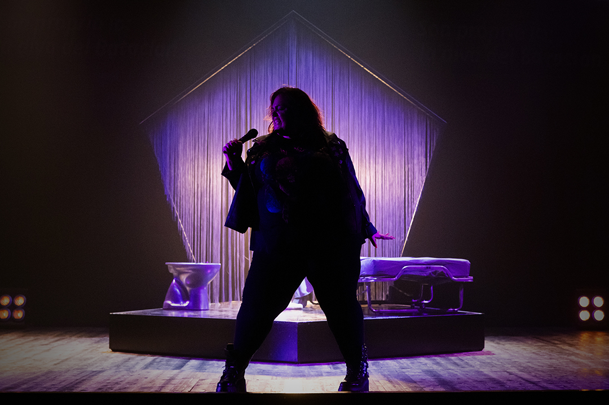

regia, drammaturgia e liriche Gabriele Paolocà
con Claudia Marsicano
e con Gabriele Correddu
musiche originali Fabio Antonelli
scene Rosita Vallefuoco
luci Martìn Emanuel Palma
drammaturgia fisica Carlo Massari
video Luca Brinchi e Gabriele Paolocà
progetto audio Niccolò Menegazzo
costumi Anna Coluccia
aiuto regia Marco Fasciana
tecnica Chiara Zaffiro
assistente volontario Matteo Libertucci
foto di scena Manuela Giusto
ufficio stampa Antonella Mucciaccio
si ringrazia per le traduzioni Marco Chenevier

produzione Cranpi, SCARTI Centro di Produzione Teatrale d’Innovazione, Romaeuropa Festival
con il contributo di MiC – Ministero della Cultura, Regione Lazio
con il sostegno del Centro di Residenza della Toscana (Armunia – CapoTrave/Kilowatt), Comune di Sansepolcro e Teatro Biblioteca Quarticciolo